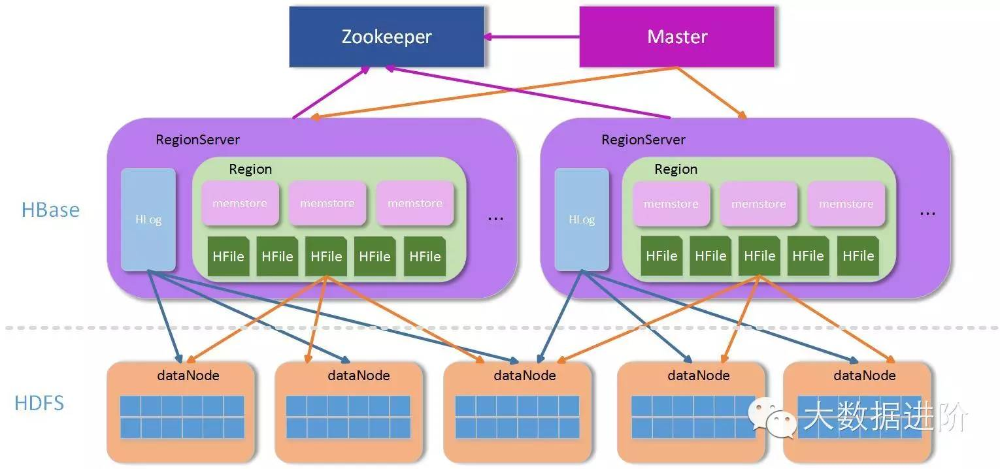
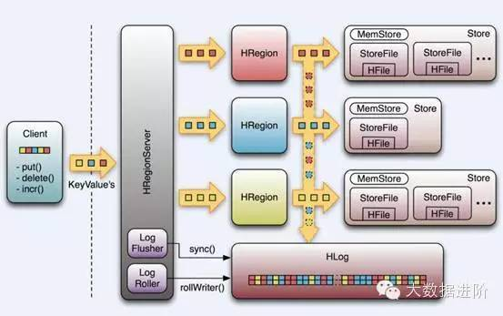

*转载自[大数据进阶](http://www.wtoutiao.com/p/10etRYt.html "大数据进阶")*

## HBase架构和组成部件

更多可以参考[网站](http://www.bitstech.net/2015/09/16/hbase-architecture/ "比特科技")http://www.bitstech.net/2015/09/16/hbase-architecture/

### 1. 简介
HBase —— Hadoop Database的简称，Google BigTable的另一种开源实现方式，
从问世之初，就为了解决用大量廉价的机器高速存取海量数据、实现数据分布式存
储提供可靠的方案  

从功能上来讲，HBase不折不扣是一个数据库，与我们熟悉的Oracle、MySQL、
MSSQL等一样，对外提供数据的存储和读取服务。  

而从应用的角度来说，HBase与一般的数据库又有所区别，HBase本身的存取接
口相当简单，不支持复杂的数据存取，更不支持SQL等结构化的查询语言；HBase也
没有除了rowkey以外的索引，所有的数据分布和查询都依赖rowkey。所以，HBase
在表的设计上会有很严格的要求。   

架构上，HBase是分布式数据库的典范，这点比较像MongoDB的sharding模式，
能根据键值的大小，把数据分布到不同的存储节点上，MongoDB根据configserver来
定位数据落在哪个分区上，HBase通过访问Zookeeper来获取-ROOT-表所在地址，通过
-ROOT-表得到相应.META.表信息，从而获取数据存储的region位置。  

### 2. 架构

上面提到，HBase是一个分布式的架构，除去底层存储的HDFS外，HBase本身从功能
上可以分为三块：Zookeeper群、Master群和RegionServer群。

Zookeeper群：HBase集群中不可缺少的重要部分，主要用于存储Master地址、
协调Master和RegionServer等上下线、存储临时数据等等。  

Master群：Master主要是做一些管理操作，如：region的分配，手动管理操作下发等等，
一般数据的读写操作并不需要经过Master集群，所以Master一般不需要很高的配置即可。  

RegionServer群：RegionServer群是真正数据存储的地方，每个RegionServer由若干
个region组成，而一个region维护了一定区间rowkey值的数据。  
整个 结构如下图：

### 3. 部件说明
* Client  
使用Hbase RPC机制与HMaster和HRegionServer进行通信  
Clinet与HMaster通信进行管理类操作
Client与HRegionServer通信进行数据读写操作

* Zookeeper  
Zookeeper Quorum存储-ROOT-、HMaster地址  
HRegionServer把自己一Ephederal方式注册给Zookeeper中，HMaster随时感知各个
HRegionServer的健康状态  
Zookeeper避免HMaster单点故障问题

* HMaster  
HMaster没有单点问题，HBase中可以启动多个HMaster,通过Zookeeper的Master
Election机制，保证总有一个Master在运行。它主要负责Table和Region的管理
工作：
  1. 管理用户对表的增删改查的功能
  2. 管理HRegionServer的负载均衡，调整Region分布
  3. Region split后，负责新的Region的分布
  4. 在HRegionServer停机后，负责失效HRegionServer上Region的迁移

### 4. HRegionServer  
HBase中最核心的模块，主要负责响应用户I/O请求，向HDFS文件系统中读写数据  

HRegionServer管理一系列HRegion对象；  
HRegion对应Table中一个Region;  
HStore对应Table中一个ColumnFamily的存储；  
ColumnFamily就是一个集中的存储单元，故将具有相同IO特性的Column放在一个
ColumnFamily会更高效
